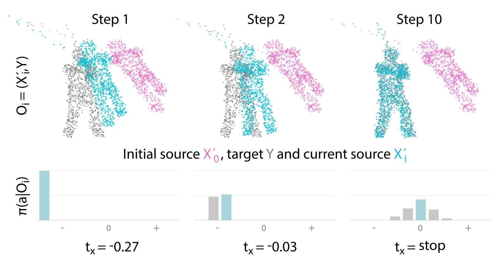
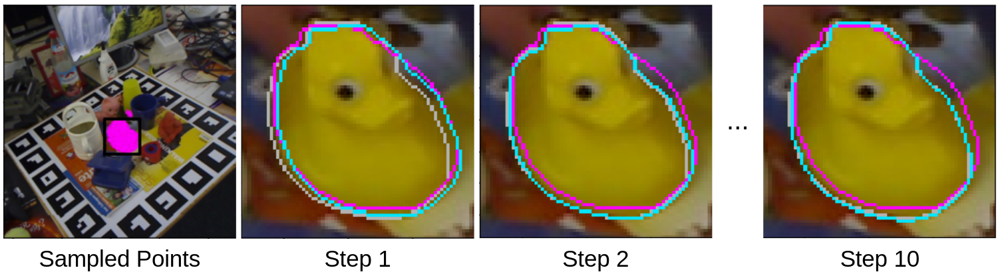

# ReAgent: Point Cloud Registration using Imitation and Reinforcement Learning
This repository implements the approach described in *ReAgent: Point Cloud Registration using Imitation and 
Reinforcement Learning* (CVPR 2021).



_Iterative registration using ReAgent: The source point cloud (cyan) is aligned to the target point cloud (gray), 
starting from an initial source (magenta). In each step, ReAgent follows policy **pi** given the current observation **O** by selecting
the best action **a** per axis. Thereby, the registration is improved step-by-step until alignment._



_Application example: Object pose estimation on LINEMOD. The source point cloud is sampled within the segmentation mask 
estimated by PoseCNN. The black box indicates the zoomed-in view used for the step-wise results. ReAgent (cyan) is 
initialized using the pose estimate of PoseCNN (magenta). The ground-truth pose is shown in gray. ReAgent achieves a 
highly accurate pose within a few steps._

## Dependencies
The code has been tested on Ubuntu 16.04 and 20.04 with Python 3.6 and CUDA 10.2. To set-up the Python environment, use 
Anaconda and the provided YAML file:

`conda env create -f environment.yml --name reagent`

`conda activate reagent`.

For experiments on the LINEMOD dataset, the [BOP Toolkit](https://github.com/thodan/bop_toolkit/tree/master/)
is additionally required. The `BOP_PATH` in `config.py` needs to be changed to the respective clone directory and the
packages required by the BOP Toolkit need to be installed.
To compute the AD scores using the BOP Toolkit, `BOP_PATH/scripts/eval_bop19.py` needs to be adapted:

- to use ADI for symmetric objects and ADD otherwise with a 2/5/10% threshold, change `p['errors']` to 
```
{
  'n_top': -1,
  'type': 'ad',
  'correct_th': [[0.02], [0.05], [0.1]]
}
```

- to use the correct test targets, change `p['targets_filename']` to `'test_targets.json'`

## Datasets and Pretrained Models

### ModelNet40
Point clouds sampled from ModelNet40 models can be downloaded [here](https://shapenet.cs.stanford.edu/media/modelnet40_ply_hdf5_2048.zip).
Extract the dataset and set the `M40_PATH` accordingly in `config.py`.

### ScanObjectNN
The ScanObjectNN dataset is currently not publicly available but can be requested from the authors (for academic use). 
Please see the [project page](https://hkust-vgd.github.io/scanobjectnn/) for further information. The corresponding parameter
in `config.py` is `SON_PATH`.


### LINEMOD
For additional experiments on the object pose estimation task, we use the version of LINEMOD prepared for the 
[BOP challenge](https://bop.felk.cvut.cz/datasets/). The required files can be downloaded to a directory of your choice 
using the following bash script:

```bash
export SRC=http://ptak.felk.cvut.cz/6DB/public/bop_datasets
wget $SRC/lm_base.zip         # Base archive with dataset info, camera parameters, etc.
wget $SRC/lm_models.zip       # 3D object models.
wget $SRC/lm_test_all.zip     # All test images.
unzip lm_base.zip             # Contains folder "lm".
unzip lm_models.zip -d lm     # Unpacks to "lm".
unzip lm_test_all.zip -d lm   # Unpacks to "lm". The training split is a subset.
```

In addition, we have prepared point clouds sampled within the ground-truth masks (for training) and the segmentation 
masks computed using PoseCNN [here](https://drive.google.com/drive/folders/1l1Qs_mW2a32yjC_4vg5kcHc4KxHrWnlX?usp=sharing) 
(for evaluation). The latter also include the initial pose estimates from PoseCNN. Extract everything into 
`PATH_TO_LM/reagent/` and set `LM_PATH` in `config.py` to the base directory, i.e., `PATH_TO_LM/..`. Finally, since the 
BOP challenge uses a different train/test split than the compared methods, the appropriate target file found 
[here](https://drive.google.com/drive/folders/1l1Qs_mW2a32yjC_4vg5kcHc4KxHrWnlX?usp=sharing) needs to be placed in the 
`PATH_TO_LM` directory.

### Pretrained models
Weights for all datasets can be found [here](https://drive.google.com/drive/folders/1NyuwzIiJGyJsCkvEOnrziwrGN56uoTTj?usp=sharing). 
Note that we use the same model for all experiments on ModelNet40 and ScanObjectNN.

## Training
As just mentioned, for the experiments on ModelNet40 and ScanObjectNN, we train a single model on the first 20 
categories of ModelNet40 in a two-step process. First, we pretrain on noise-free samples using 

`python registration/train.py --mode=pretrain`.

Then, we finetune the model on noisy samples (as described in the paper). For this, use

`python registration/train.py --mode=MODE`,

where `MODE` is either IL-only (`il`) or IL+RL using the stepwise reward (`ilrl`). The pretraining and finetuning step 
take about 1h each on a GTX 1080.

For the experiment on LINEMOD, we skip the pretraining step and directly train on the noisy samples. Training 
takes about 1h on a GTX 1080 using

`python registration/train.py --mode=MODE --dataset=lm`.

## Evaluation

### ModelNet40 and ScanObjectNN
To compute the results for ModelNet40 and ScanObjectNN, run

`python registration/eval.py --mode=MODE --dataset=DATASET`,

with `DATASET` being either `m40-model` (first 20 categories, test split), `m40-cat` (last 20, test split) or, for 
ScanObjectNN, `son`.

### LINEMOD
The results for LINEMOD are computed using the BOP Toolkit. The evaluation script exports the required file by running

`python registration/eval.py --mode=MODE --dataset=lm`,

which can then be processed via

`python BOP_PATH/scripts/eval_bop19.py --result_filenames=PATH_TO_CSV_WITH_RESULTS`.

### Visualization
In addition to the quantitative evaluation, we provide a visualization of the registration process for all datasets. Add 
`--visualize` when running `eval.py` to show the point clouds (ModelNet40, ScanObjectNN) or object outlines (LINEMOD).

## Citation
If you use this repository in your publications, please cite

```
@article{bauer2021reagent,
    title={ReAgent: Point Cloud Registration using Imitation and Reinforcement Learning},
    author={Bauer, Dominik and Patten, Timothy and Vincze, Markus},
    booktitle={IEEE Conference on Computer Vision and Pattern Recognition (CVPR)},
    year={2021}
}
```